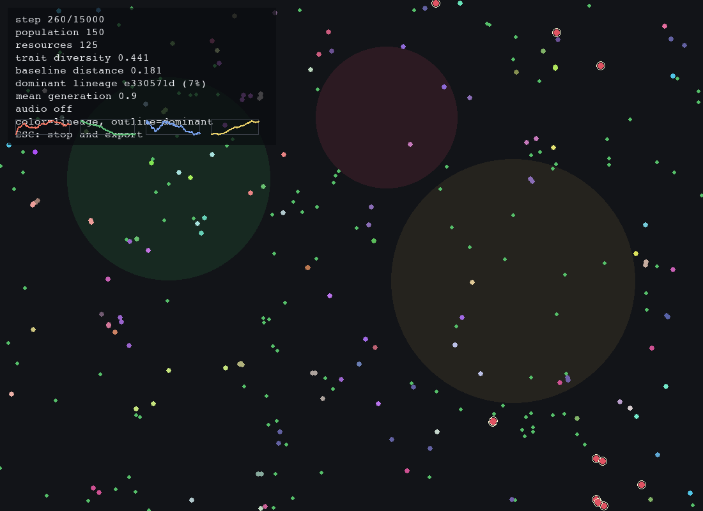

# Evolving Digital Ecologies

### A research-grade artificial life simulation for emergent evolution, adaptation, and complex ecological dynamics.

**Evolving Digital Ecologies** is a Python-based artificial life research platform where autonomous digital organisms move, consume resources, age, reproduce, mutate, compete, cluster, collapse, and adapt inside a dynamic two-dimensional world.

It is designed as a serious experimental system for exploring how population-level structure can emerge from local rules, inherited traits, mutation, environmental pressure, and decentralized agent behavior.

> **Research premise:** no global fitness function is imposed. Selection emerges indirectly from survival, resource access, reproduction, mutation, and changing environmental constraints.



**Demo video:** [Eine Welt im Computer](https://github.com/JoHendel/evolving-digital-ecologies/releases/download/v1.0.0/eine-welt-im-computer.mp4)

---

## Why This Matters

Artificial life is a powerful way to study a central scientific question:

> How can complex collective behavior arise from simple local interactions?

This project turns that question into an executable simulation environment. Instead of describing emergence only theoretically, it creates a measurable digital ecology where adaptation, lineage dominance, diversity loss, spatial clustering, and long-term drift can be observed directly.

The system is especially useful for:

- studying emergent behavior in artificial ecosystems
- experimenting with mutation and selection pressure
- visualizing evolutionary dynamics over time
- comparing heuristic behavior with neuroevolutionary controllers
- generating reproducible data for thesis-level analysis
- communicating complex systems through visual, audio, and textual outputs

---

## Core Features

- **Autonomous digital organisms** with energy, age, health, position, heading, inherited traits, and lineage identity.
- **Dynamic 2D ecology** with renewable resources, environmental zones, hazard pressure, fertile areas, poor regions, and climate oscillations.
- **Evolutionary reproduction** with heritable genomes, bounded mutation, optional major mutation events, and generation tracking.
- **Emergent selection** without a handcrafted global fitness score.
- **Behavior controllers** for interpretable heuristic behavior and optional neuroevolutionary decision-making.
- **Scientific metrics** for population size, resources, energy, trait diversity, lineage dominance, clustering, and evolutionary drift.
- **Baseline Distance Index** to quantify gradual divergence from the initial population state.
- **Live visualization** with Pygame, lineage coloring, dashboard metrics, and optional perception rendering.
- **Sonification layer** that maps evolutionary change into audio cues for multimodal interpretation.
- **Accessible exports** including screen-reader-friendly text summaries.
- **Experiment runner** for mutation sweeps, environment sweeps, and behavior comparisons.
- **Pytest coverage** for deterministic seeds, reproduction, mutation bounds, metrics, resource consumption, and world updates.

---

## Research Vision

The project investigates evolution as a process that is simultaneously biological, computational, spatial, and perceptual.

At the model level, organisms adapt through mutation and inheritance. At the ecological level, local interactions produce population-level structure. At the analytical level, the simulation records metrics that make the evolutionary process measurable. At the presentation level, visual and audio outputs make gradual systemic change easier to perceive.

The long-term ambition is to create a compact but credible artificial life laboratory: a place where small rule changes can produce surprisingly different worlds.

---

## System Architecture

```text
main.py
  |
  |-- src/core/              configuration, geometry, deterministic random streams
  |-- src/agents/            organisms, genomes, traits, lifecycle state
  |-- src/world/             resources, zones, climate, spatial world model
  |-- src/behavior/          perception, action selection, behavior controllers
  |-- src/evolution/         mutation, reproduction, lineage tracking
  |-- src/neuroevolution/    inheritable neural controller primitives
  |-- src/simulation/        simulation engine and step orchestration
  |-- src/analytics/         metrics, summaries, CSV/JSON/text exports
  |-- src/visualization/     live rendering, plots, sonification
  `-- src/experiments/       reproducible parameter sweeps
```

The simulation loop is intentionally readable:

1. Update the world and resource field.
2. Let each agent perceive local signals.
3. Select an action through the configured controller.
4. Apply movement, energy consumption, interactions, aging, and hazards.
5. Reproduce agents that meet local energy conditions.
6. Mutate inherited traits and track lineage history.
7. Record metrics and export scientific artifacts.

---

## Emergent Behavior Goals

The project is built to explore whether simple agents can produce higher-level ecological patterns:

- stable or unstable population growth
- lineage dominance and lineage extinction
- clustering around resource-rich zones
- competitive exploitation of scarce resources
- gradual trait drift away from the initial population
- collapse under mutation or environmental pressure
- differences between heuristic and neural control strategies
- measurable divergence between visual, sonic, and trait-based baselines

---

## Simulation Capabilities

### Evolutionary Dynamics

Agents reproduce when they accumulate enough energy. Their offspring inherit mutable traits such as speed, metabolism, perception range, aggression, social tendency, exploration tendency, risk sensitivity, and reproduction cost.

### Environmental Pressure

The world contains resources, hazards, fertile zones, poor zones, and climate variation. Survival depends on the interaction between inherited traits and local ecological conditions.

### Scientific Output

Every run can produce:

- `metrics.csv`
- `summary.json`
- `final_population.csv`
- `accessible_summary.txt`
- `config_snapshot.yaml`
- plots for population, resources, energy, diversity, traits, spatial lineages, phase behavior, and baseline distance

### Multimodal Interpretation

The live mode can make evolution visible through lineage colors and audible through a lightweight sonification model. This supports both presentation and accessibility: visual trends, audio patterns, and text summaries all describe the same evolutionary process from different angles.

---

## PyCharm Quick Start

### 1. Open the Project

Open this folder directly in PyCharm:

```text
alife_thesis_sim_github_upload
```

### 2. Create the Interpreter

In PyCharm:

```text
Settings -> Project -> Python Interpreter -> Add Interpreter -> Virtualenv
```

Use:

```text
Location: <project root>/.venv
Base interpreter: Python 3.11 or Python 3.12
```

Python 3.11 or 3.12 is recommended. Python 3.14 may have compatibility issues with `pygame`.

### 3. Install Dependencies

Open the PyCharm terminal in the project root and run:

```bash
python -m pip install -r requirements.txt
```

### 4. Run a Quick Simulation

```bash
python main.py --config configs/quick_demo.yaml --plot
```

### 5. Run Tests

```bash
python -m pytest
```

---

## PyCharm Run Configuration

Use these exact values for the main run configuration:

```text
Name:
ALife Quick Demo

Script path:
$PROJECT_DIR$/main.py

Working directory:
$PROJECT_DIR$

Interpreter:
$PROJECT_DIR$/.venv/bin/python

Parameters:
--config configs/quick_demo.yaml --plot

Environment variables:
PYTHONUNBUFFERED=1;MPLCONFIGDIR=$PROJECT_DIR$/.matplotlib
```

On Windows, the interpreter path will usually be:

```text
$PROJECT_DIR$\.venv\Scripts\python.exe
```

For the interactive live window, create a second Python run configuration with:

```text
Script path:
$PROJECT_DIR$/main.py

Working directory:
$PROJECT_DIR$

Interpreter:
$PROJECT_DIR$/.venv/bin/python

Parameters:
--config configs/long_live_analysis.yaml --live

Environment variables:
PYTHONUNBUFFERED=1;MPLCONFIGDIR=$PROJECT_DIR$/.matplotlib
```

---

## Example Experiments

### Quick Demonstration

```bash
python main.py --config configs/quick_demo.yaml --plot
```

### Live Evolution View

```bash
python main.py --config configs/long_live_analysis.yaml --live
```

### Long Headless Evolution Run

```bash
python main.py --config configs/long_evolution.yaml --plot
```

### Mutation Sweep

```bash
python main.py --experiment configs/experiment_mutation_sweep.yaml
```

### Behavior Comparison

```bash
python main.py --experiment configs/experiment_behavior_comparison.yaml
```

---

## Roadmap

- stronger statistical analysis for repeated runs
- additional experiment templates for collapse and recovery scenarios
- richer spatial acceleration for large populations
- improved plots for lineage survival and trait covariance
- optional notebook workflow for post-run analysis
- richer live dashboards for presentation mode
- expanded neuroevolution experiments

---

## Future Research Extensions

- predator-prey coevolution
- multi-species ecosystems
- territoriality and niche formation
- communication protocols between agents
- memory and within-lifetime learning
- mate selection and sexual selection
- environmental catastrophes and recovery dynamics
- statistical significance testing across repeated simulations
- comparison against established artificial life benchmarks

---

## Project Structure

```text
alife_thesis_sim_github_upload/
|-- main.py
|-- requirements.txt
|-- pyproject.toml
|-- README.md
|-- configs/
|   |-- default.yaml
|   |-- quick_demo.yaml
|   |-- long_evolution.yaml
|   |-- long_live_analysis.yaml
|   |-- neural.yaml
|   `-- experiment_*.yaml
|-- src/
|   |-- agents/
|   |-- analytics/
|   |-- behavior/
|   |-- core/
|   |-- evolution/
|   |-- experiments/
|   |-- neuroevolution/
|   |-- simulation/
|   |-- utils/
|   |-- visualization/
|   `-- world/
|-- tests/
|-- docs/
|-- notebooks/
|-- media/
|   |-- eine-welt-im-computer.mp4
|   `-- live_preview.png
|-- data/
|   |-- logs/
|   |-- runs/
|   |-- exports/
|   `-- plots/
```

---

## Screenshots / Visual Output

Live simulation preview:


Additional visual artifacts can be added here after future runs:

- live simulation screenshot showing agents, resources, zones, and lineage colors
- animated GIF of population movement and lineage dominance
- plot grid from `data/runs/<run_name>/plots/`
- short visual comparison of heuristic vs neuroevolutionary behavior

Current demo video:

[Eine Welt im Computer - MP4 download](https://github.com/JoHendel/evolving-digital-ecologies/releases/download/v1.0.0/eine-welt-im-computer.mp4)

If GitHub's file preview appears blank, use the release download link above. The MP4 is also stored in the repository at `media/eine-welt-im-computer.mp4`.

---

## Technical Highlights

- deterministic random stream design for reproducible simulations
- dataclass-based configuration schema mapped directly from YAML
- modular architecture separating world, agents, behavior, evolution, metrics, and visualization
- bounded trait mutation for numerical stability
- lineage tracking for founder lines, births, deaths, and dominance analysis
- reusable experiment runner for parameter sweeps
- CSV, JSON, text, and plot exports for research workflows
- PyCharm-friendly root execution with `main.py`
- test suite covering key simulation invariants

---

## Scientific Relevance

This repository sits at the intersection of artificial life, complex systems, evolutionary computation, agent-based modeling, and computational intelligence.

It is not a black-box animation. It is a structured simulation environment where model assumptions are explicit, configurations are versionable, outputs are reproducible, and results can be inspected quantitatively.

The strongest scientific idea in the current version is the combination of:

- **evolutionary change** through mutation, reproduction, and selection
- **ecological constraint** through resource scarcity and spatial zones
- **perceptual interpretation** through visualization, sonification, and accessible summaries
- **baseline drift measurement** through the Baseline Distance Index

That combination makes the project useful not only for producing emergent behavior, but also for asking how gradual systemic change becomes visible, audible, and measurable.

---

## Contributing

Contributions are welcome if they keep the project scientifically readable and experimentally useful.

Good contribution areas include:

- new experiment configurations
- additional metrics
- improved visualization
- performance improvements for large populations
- stronger statistical analysis
- documentation and reproducibility improvements

Please keep changes modular, tested where appropriate, and aligned with the existing architecture.

---

## License

This project is prepared for public release under the MIT License. See [LICENSE](LICENSE) for details.

---

## Closing Note

Artificial life is compelling because it turns a small set of rules into a living question: what happens when adaptation is allowed to unfold?

This project is a compact laboratory for that question: a digital ecology where evolution can be run, watched, measured, heard, and studied.
